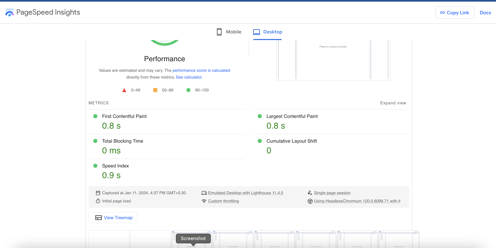
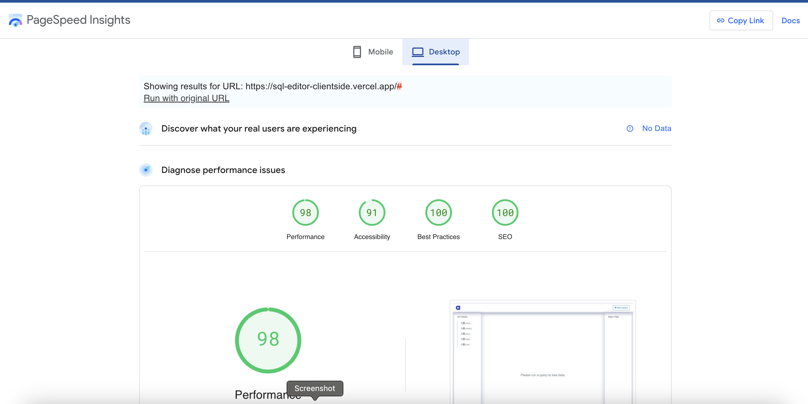

# Online SQL Editor

The application in question is created as a task for Atlan. It gives users the ability to execute SQL queries in an online editor and examine the results of those queries' execution.
**[React](https://reactjs.org/)**, and the **[React Bootstrap](https://react-bootstrap.github.io/)** are used for developing client-side application. Data is borrowed from [available](https://github.com/graphql-compose/graphql-compose-examples/tree/master/examples/northwind/data/csv) repository. The sections below detail the salient features of this project.

## Features

1. **Tabs for Navigation**: Do you want to simultaneously browse a table and run a query? Yes, please proceed. You can return to a tab's previous location as long as you don't reload the page because each tab retains its own distinct state.
2. **Dynamic Tables**: The real data is not fetched at first, only the list of tables is. The entries are only retrieved when you click on the name of a table, hence maintaining the application's speed and light weight.
3. **Response Time**:Additionally, the user can have a look on the duration to finish a query, providing them with an indicator to assess the system's efficiency.
4. **Ability to save the results as CSV**: This application includes functionality to save the data of a query in CSV format.
5. **Search Functionality**: Users can search data in table based on keywords they enter.
    _**Add-Ons**: You can also save a query till the page gets refreshed,so that you don't have to type the same thing twice!_

## Performance Audit
- **[PageSpeed Insights](https://pagespeed.web.dev/analysis/https-sql-editor-clientside-vercel-app/i39y9bh8wz?form_factor=desktop)**: The site also scores **98 points in performance** and **100 points in best practices**. The exact metrics are:
  - **First Contentful Paint**: `0.8s`
  - **Last Contentful Paint**: `0.8s`
  - **Speed Index**: `0.9s`
  - **Total Blocking Time**: `0ms`
  - **Cumulative Layout Shift**: `0ms`

- **[GTmetrix](https://gtmetrix.com/)**: The fully loaded time is **0.7 seconds**, with the performance rating of **100%** and structure rating of **98%**. The site receives an A grade too.

  

  
  

## Optimisations
- **Dynamic fetching of table data**: A table's rows are only retrieved upon the user's request i.e. by clicking table name. By spreading total number of requests over queries, this reduces our initial load time by several seconds.
- **Active use of the `useMemo` hook**: The 'useMemo' hook optimizes performance by memoizing the results of computations with the same dependencies, reducing unnecessary re-computations. In the case of tables, the data is fully 'memoized', enhancing efficiency.
- **Streamlined API call management**: Through judicious use of the useEffect hook, the project has successfully curtailed the number of API calls, resulting in a nearly 2-second reduction in processing time after each user interaction.

## Addtional Optimization Practices
- **Intelligent use of the React-Bootstrap library:** Let's suppose we want to import a `Table` component. There are two ways to do that:
  - `import { Table } from "react-bootstrap";`
  - `import Table from "react-bootstrap/Alert";`   
The former imports the entire library before extracting the Table component, whereas the latter, a more optimized approach, directly imports only the Table component, significantly enhancing load times – the method adopted in this project.
- **Minimizing state changes for optimal performance**: Despite a slight reduction in the feature set, the project has excelled in load time due to a conscious effort to minimize the number of state changes during re-renders.
- **Hosted on Vercel**: The website is hosted on Vercel, renowned for being among the swiftest free hosting platforms for JavaScript-based web apps. This is attributed to its efficient CDN and caching features. Additionally, Vercel offers complimentary SSL during hosting, enhancing both page security and potential search engine ranking.

## How to run locally?

In the project directory, you can run:

### `yarn start`

Runs the app in the development mode.\
Open [http://localhost:3000](http://localhost:3000) to view it in the browser.

The page will reload if you make edits.\
You will also see any lint errors in the console.

### `yarn build`

Builds the app for production to the `build` folder.\
It correctly bundles React in production mode and optimizes the build for the best performance.

The build is minified and the filenames include the hashes.\
Your app is ready to be deployed!

See the section about [deployment](https://facebook.github.io/create-react-app/docs/deployment) for more information.
